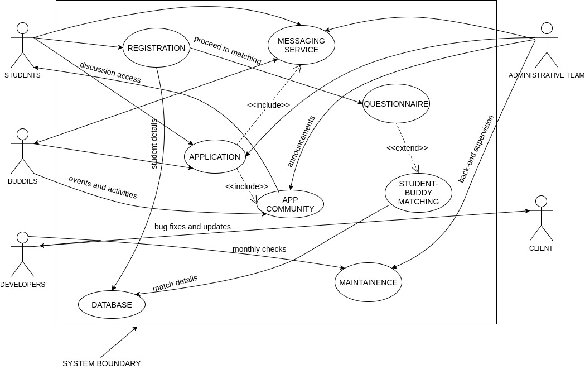
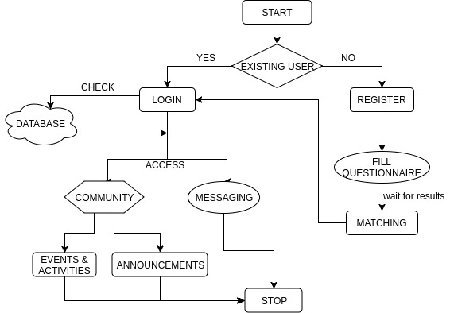

# Requirements

## Stakeholders

1. **University of Bristol - International Office**
*  Client - The biggest stakeholder of the project.
*  Resource Managers - The support for the project. They provide us with the right people for the right task.

2. **Application Users**
*  International Students - The target audience of the project. This app is primarily designed to benefit the students coming to the university via the _Global Transfer Program_.
* Buddies - The volunteers. Student ambassadors and many currently studying students. They will be the reliable point of contact for the incoming international students. They will provide regular peer support using the app.

3. **Developers**
* The creators of the application - We are responsible for most of the project, which includes app constraints, time and cost estimates and overall app development.

4. **Development Support**
* Lecturers - Our lecturers provided us the platform and taught us the fundamentals to work on the application as a team.
* Mentor - We have been assigned a mentor (from the university) as our first point of contact for the project. With his level of experience and guidance, we were able to develop the application.
* Back-end supervisors - A bunch of employees who will use and monitor the application periodically to ensure proper functionality. Bugs, information security and all application related issues will be noted down and informed.

5. **Application Platform**
* Google PlayStore - Since the application is primarily for android phones, the PlayStore are one of the stakeholders as its the only point of installation.

___

## User Flow-Chart

* Initially, the user will have to register if they haven't already signed up so this involves filling in the questionaire which in turn triggers the matching process to find a suitable buddy.
* If the user has already registered before the student can log in where their login credentials are cross-checked with the database and then they are given access to both the community and messaging features.

### Using the Messaging Service: Alternative flow
1. The Student must login by entering his/her credentials.
2. The Student can access the Community to check the upcoming events and announcements. On choosing the option to send a message to the buddy about the event, the Student can access the messaging service.

### Using the Messaging Service: Exceptional flow
1. The Student tries to login with the wrong credentials.
2. The Student should be redirected to the login page with an alert message asking to login again.

___

## Functional Requirements

1. **Student/Buddy registration**
* Sign-up details - The buddy and student will both have to register by filling up a questionnaire. However, both will have different registration processes.
     * Student - Filling up of personal details followed by a simple set of personality and preference questions. Before registration, the student is allowed to prioritise his/her sections based on preference.
     * Buddy - Similar to the former, but does not include the set of preference questions. We take note of the availability and timings of the buddies so that they are approachable face-to-face during that period.
     * The user should be able to save his/her details and proceed to using the app after clicking the 'Register' button.
    * Data Security - The information of the users will only be stored until the end of the student's course. All details will be erased after the end of the academic year and will be refreshed the following year.

2. **Medium of Communication**
* E-mails - Since the student and the buddy register with their e-mails, they can communicate with each other through the same. However, the app caters to other social media as well. Namely:
     * Facebook/Messenger - One of the most common social media in the market. We have integrated the messenger service on our app
     * WeChat - Considering the ban of common messaging services like WhatsApp in markets such as China, Bangladesh and Iran, we offer the students to chat with their buddy through an alternative known as WeChat.

3. **Central Space**
* App Community - One of the core functions of the app.The community is identical to a social group where buddies and students can communicate as an entire group. The community focuses on two main features:
     * Events and Activities - Static pages which contains details of the upcoming events will be linked to the community. The user should be able to view the respective event on a button click and will be redirected to another page.
     * Announcements - The administrative team has access to the community to update all users about the key activities, updates and deadlines.

4. **Student-Buddy Matching**
* Matching Algorithm - The crux of the application. The student after registration, must fill in the questionnaire in order to get matched with a buddy with similar interests (buddies are pre-registered volunteers). The questionnaire is primarily focused on 3 criteria:
     * Personality - Basic questions on how the student feels about him/herself. Includes socialising, interests and hobbies.
     * Motivations - To understand the student's motivations in life and passion for the respective course.
     * Expectations - To essentially see and understand the student's expectations from the university and the people.
* Prioritising - After filling in the questionnaire, we give the students the liberty to prioritise their criteria so that it improves our matching search as well has helps them get the right buddy.

5. **Messaging Service**
* The student needs to be able to send and receive messages with their allocated buddy.
    * Should include an option to set up notifications from the application to see when someone has sent you a message.
    * Need to be able to store conversation history and provide users with this in case they log in with a different machine.
    * Need to be ale to send and receive messages without any loss of data  to improve user experience.
* Group messaging should also be supported to create a channel of communication between all buddies and all students.
    * needs to be scalable because the global transfer programme is set to expand within a few years time so it needs to be able to cope with the load on the system.

___

## Non-functional Requirements

1. **Application Usability**
* Readability - Need to make sure the font is comfortable for the user as well as avoiding colours that dissolve into the background. Make sure to keep spacing consistent and ensure clarity is maintained throughout the text used.
* Too many buttons - We need to make sure to keep the number of taps to a minimum for the user by keeping a balance between providing enough information and making navigation quick.
* Single platform - By keeping the application just on the Android platform, we can focus all our time optimizing for one platform so it would provide a better overall user experience.
* Avoid confusing content - Need to avoid focusing on impressive design over usable architecture which involve getting rid of features which might complicate the architecture. Maintain simplicity with easy to understand tools.

2. **Responsiveness**
* Startup time - Users are impatient when they are opening applications so to improve startup time we need to load less things within this time to improve user experience. This involves reducing the size of bitmaps, delaying the initialization of the background processes so the first screen loads faster.
* Loading data - User's data needs to be loaded from a server before anything is shown to the user but this request needs to be streamlined to be as fast as possible. This is fundamental to the messaging service feature because the history of messages sent have to be loaded as soon as the user clicks onto this service. This could be done by either optimizing the API or optimizing the app itself to be faster.
* Network Requests - The less data you request the faster your response time is going to be so it is worth starting to make the request for the next page of data before you reach the last item of the current page.
* Processing time - Matching a student with a buddy needs to be quick. If the algorithm takes too long it could dissuade the user from continuing use since it is one of the very first interactions the user will have with the application.

3. **Reliability**
* Software Monitoring - We want to make sure to account for the reliability of the system in its future operation which involves monitoring the software for crashes and bugs and fixing them accordingly. This is because we could only estimate future reliability by looking at the past.
* Adaptive Approach to developing - Every change in the system's architecture affects the reliability(could lead to a crash). This is particularly important for the Bristol Buddies application because it should be able to scale for use for up to 500 people by 2022 so we need to be able to push changes in a way that does not make the entire system unusable.
* Minimise down-time - Since we are being tasked to build a social application, we will have to reconfigure the architecture frequently so the ability to assess its impact on the reliability of the application and determine the most reliable configuration is critical. Since it is also a messaging application, down-time needs to be low to avoid major inconvenience for the user.

4. **Security**
* Secure code from ground up - We should stick to modern well-supported algorithms coupled with API encryption so that none of the information we request from the database to aid the matching process falls into the wrong hands. Code should be secure but not at the cost of performance or user experience.
* Secure Network Connections - Server that our API is accessing should have measures to protect data and prevent unauthorised access. APIs should be verified so we can prevent eavesdropping on information passing between the students and the database.
* Authentication - During registration, the students and buddies would be asked to pick a password which would be stored according to Data Protection laws so once they log out, they would be able to log back in with ease. Since passwords are sensitive, they will need to be stored in encrypted form(base 64).
* Detecting Vulnerabilities - Before code is pushed, it should be tested vigorously not only for confirming functionality but also for security so potential vulnerabilities are detected and corrected beforehand.

5. **Aesthetics**
* Sleek and simple- the design of the application should be kept simple with a consistent colour code. Design should not be cluttered with a lot of text or images.
